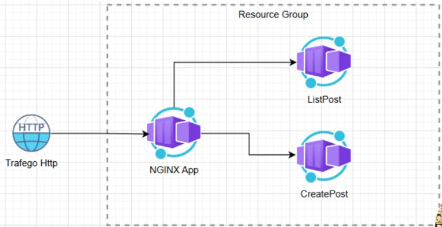
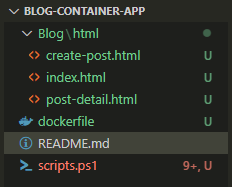
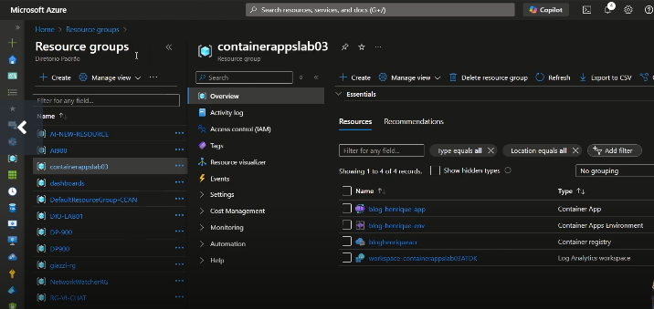

# blog-container-app
Desafio Projeto Criando um Blog com Container Apps - DIO

Visão geral

No VSCode, cria-se o arquivo index.html

Cria-se o Dockerfile

Cria-se o Resource Group e Container Registry

Login no ACR

